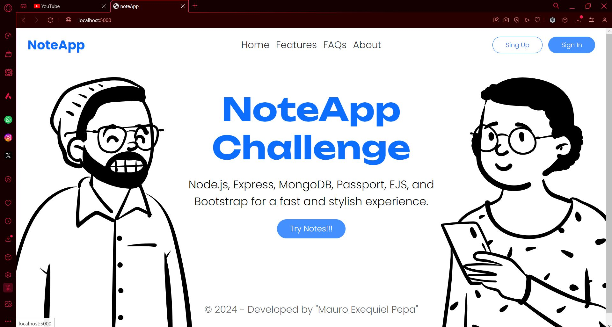

# noteApp_MERN
 Ensolvers_TechChallenge

 

## Description

This is a NodeJS notes application that allows users to create, view, update, and delete notes. 
Additionally, the application supports Google authentication to access app features.

## Technologies Used

- **Node.js**: Runtime platform for server-side JavaScript.
- **Express.js**: Node.js web framework to ease web application development.
- **MongoDB**: NoSQL database for storing notes and user details.
- **Passport.js**: Authentication middleware for Node.js.
- **Bootstrap**: Open-source design framework for HTML, CSS, and JS.
- **EJS**: Template system for HTML generation.

## Installation And Run
To install and run this project - install dependencies using npm and then start your server:

- $ npm install
- $ npm start

## Set Environment Variables:
Create a .env file in the root directory and configure necessary environment variables. 
Example:

- MONGODB_URI=your_mongodb_uri
- GOOGLE_CLIENT_ID=your_google_client_id
- GOOGLE_CLIENT_SECRET=your_google_client_secret
- GOOGLE_CALLBACK_URL=your_google_callback_url

## Project Structure
- **views**: Contains frontend.
- **server**: Contains backend.
- **public**: Contains stylesComponents.

## Project History

This project was initially developed in a private repository on my personal GitHub account.
Feel free to visit the original repository for a detailed history of commits, development progress, and any additional features that might have been added after the export.

**Original Repository:**
- Repository: [Original Repository](https://github.com/PEPAXD/noteApp_MERN)

## Author MAURO PEPA
- **github**: [GitHub Profile](https://github.com/PEPAXD)
- **linkedin**: [Linkedin Profile](www.linkedin.com/in/mauro-pepa-dev)
- **Instagram**: [Linkedin Profile](https://www.instagram.com/mauropepa97/)

## License
This project is licensed under the MIT License. See the LICENSE.md file for more deta

---
Follow me for more Projects
